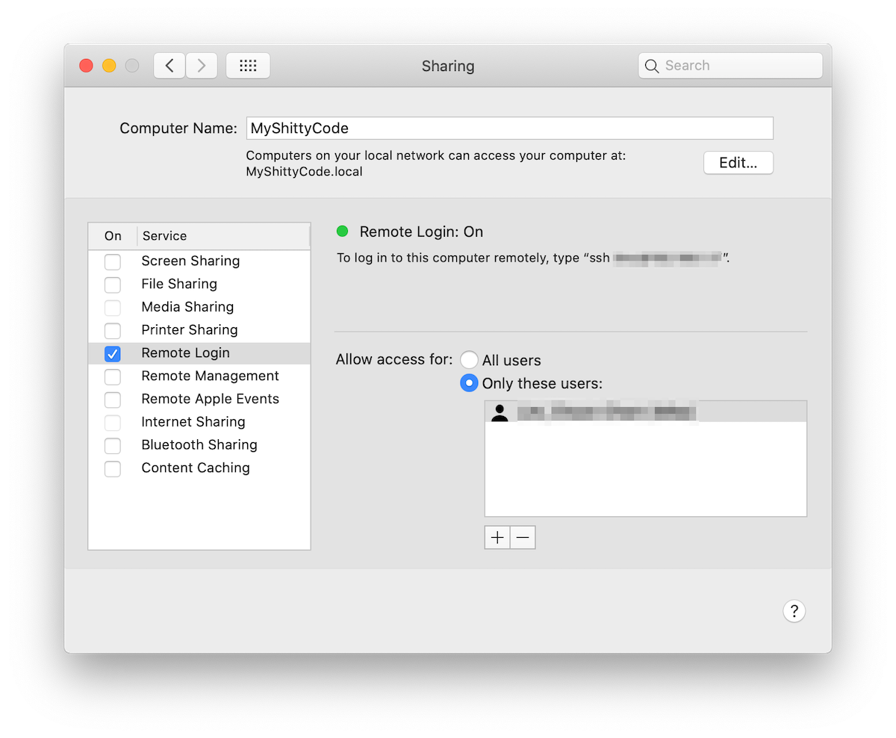
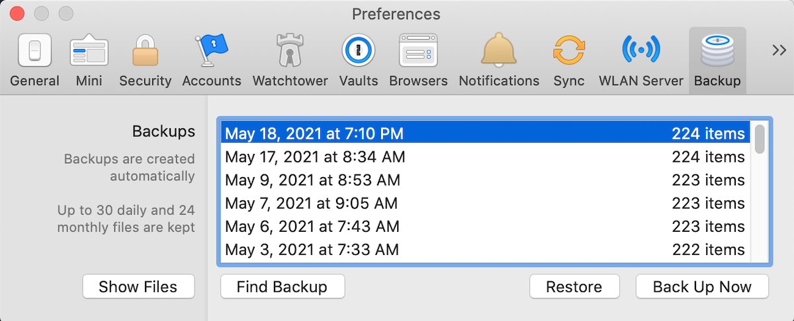

# 1Password Backup Sync

Syncs 1Password's backup files to multiple Macs. This applies to 1Password bought as standalone license, not membership.

Tested on:
- macOS Big Sur (Intel)
- macOS Monterey (Intel)
- macOS Ventura (Apple Silicon)

# Getting Started (One Time Setup)

**IMPORTANT: Repeat the following steps in each host.**

- Ensure SSH keypair exists (ex: `~/.ssh/id_rsa` and `~/.ssh/id_rsa.pub`). If missing, run create one:

```shell
ssh-keygen
```

- Copy public key (ex: `~/.ssh/id_rsa.pub`) to each remote host's `~/.ssh/authorized_keys`. If this file doesn't exist,
  create it.

- Ensure the current machine's `.ssh/` directory and file have correct permission:

```shell
chmod 700 ~/.ssh
chmod 600 ~/.ssh/authorized_keys
```

- In the current machine's `/etc/hosts`:
  - Add all remote hosts
  - Add hostname to `127.0.0.1`

```bash
127.0.0.1      localhost myshittycode # if current machine's hostname is "myshittycode"
192.168.1.100  donkeykong # remote host 1
192.168.1.200  supermario # remote host 2
```

- Enable the remote login and grant yourself the access to this service.



- Test SSH connection to remote host to ensure they work.

```bash
ssh user@donkeykong
ssh user@supermario
```

- Made a copy of `inventory-sample.yml` and rename it as `inventory.yml`.

- Modify `inventory.yml` to add all hosts.

- Test SSH connection with Ansible.

```shell
ANSIBLE_PYTHON_INTERPRETER=$(which python3) ansible all -i inventory.yml -m ping
```

# Syncing the Latest Backup File to all Remote Hosts

To push the latest backup file from the current machine to all remote hosts, run Ansible playbook.

```shell
ANSIBLE_PYTHON_INTERPRETER=$(which python3) ansible-playbook main.yml
```

- In each remote host:

  - Open 1Password.

  - Go to `Preferences` > `Backup`.

  - The synced backup file should appear in the list.

  - Select it and click **Restore** button.


